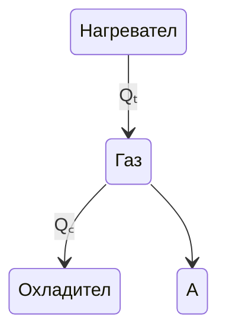

# 1. Топлинна машина - машина, извършваща механична работа чрез топлинен трансфер

# 2. Цикъл на Карно

# 3. Устройство на топлинна машина

- Коефициент на Полезно Действие (КПД) - $$\eta$$

$$
А = Q_T - Q_C
$$
$$
\eta = \frac{A}{Q_T} = \frac{Q_T - Q_C}{Q_T} = \left(1 - \frac{Q_C}{Q_T}\right) %
$$

> $$\eta < 100%$$
{: .prompt-warning }
